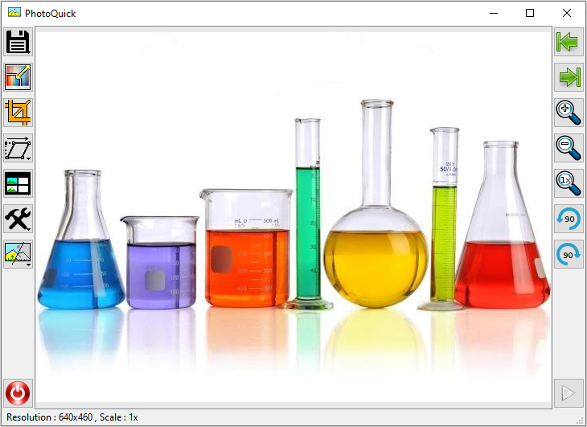

# PhotoQuick Examples

## Description

This git contains examples of using photoquick (https://github.com/ImageProcessing-ElectronicPublications/photoquick) and its plugins (https://github.com/ImageProcessing-ElectronicPublications/photoquick-plugins).

* [photoquick](./main)
* [plugins](./plugins)

## Links

* https://github.com/ksharindam/photoquick
* https://github.com/ImageProcessing-ElectronicPublications/photoquick
* https://github.com/ImageProcessing-ElectronicPublications/photoquick-plugins

----

2020
