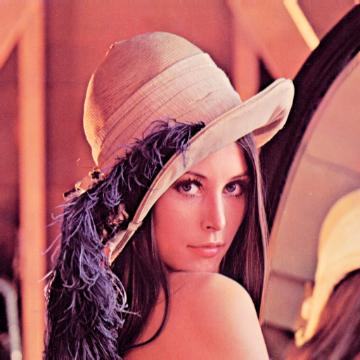
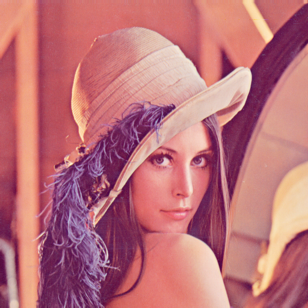

# PhotoQuick Examples

([photoquick](https://github.com/ImageProcessing-ElectronicPublications/photoquick))

## Filters: Brightness

Origin:  

Enhance Contrast:  

Enhance Low Light:  

Gamma Correction {1.20}:  

----

2021
