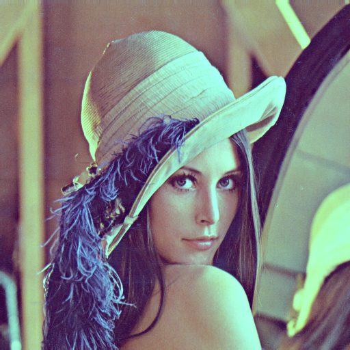
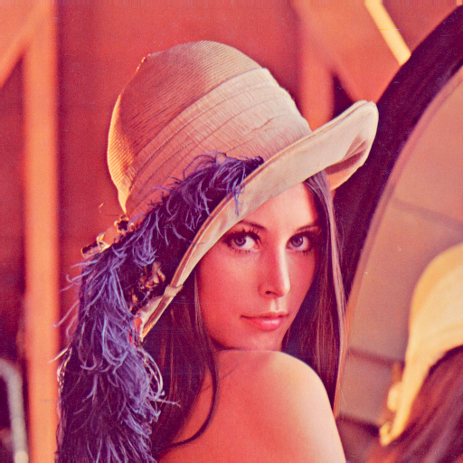
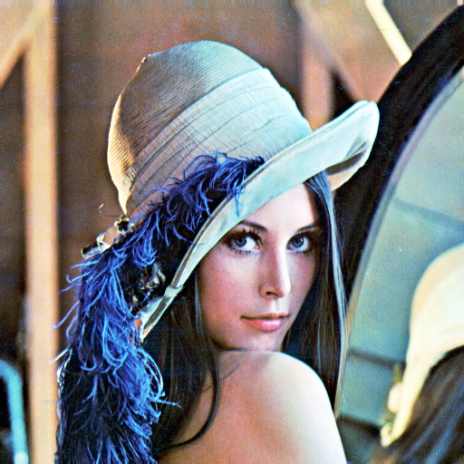
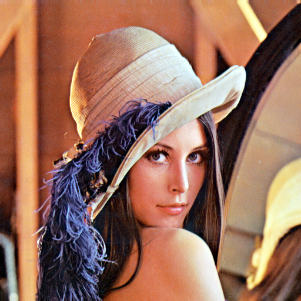

# PhotoQuick Examples

([photoquick](https://github.com/ImageProcessing-ElectronicPublications/photoquick))

## Filters: Colors

Origin:  

Color Balance:  

Enhance:  

Equalize:  

Gray Scale:  

White Balance:  

----

2020
