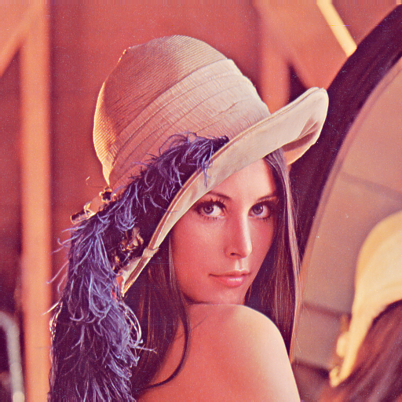

# PhotoQuick Examples

([photoquick](https://github.com/ImageProcessing-ElectronicPublications/photoquick))

## Filters: Smooth

Origin:  

Smooth/Blur {5}:  

Smooth/Blur {-5}:  

Sharpen:  

Box {5}:  

Easy deBlur {5}:  

----

2021
