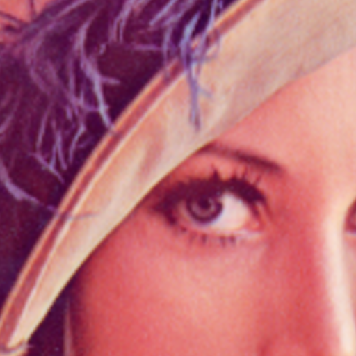
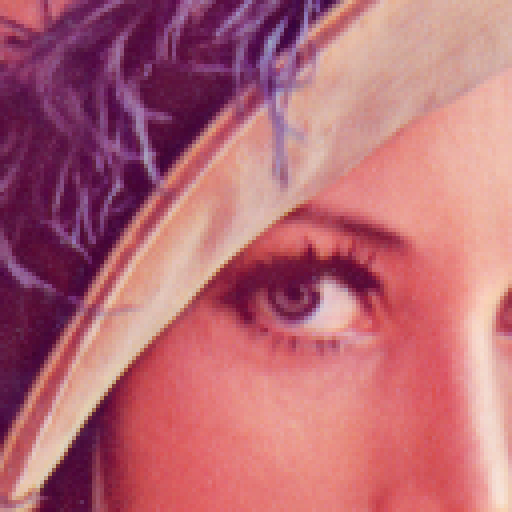

# PhotoQuick Examples

([photoquick](https://github.com/ImageProcessing-ElectronicPublications/photoquick))

## Resize

Origin:  

Smooth {4} (default) (crop center):  

Smooth enable RIS {4} (crop center):  

Smooth (biCubic) {4} (crop center):  

Smooth (biCubic) enable RIS {4} (crop center):  

Smooth (biAkima) {4} (crop center):  

Smooth (biAkima) enable RIS {4} (crop center):  

No smooth {4} (crop center):  

----

2022
