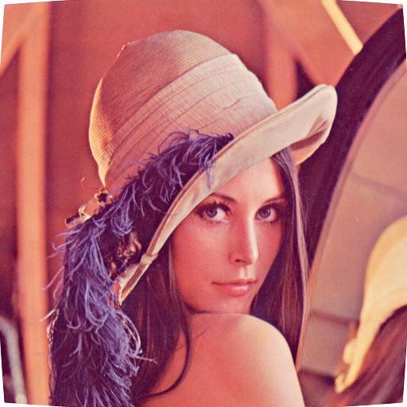

# PhotoQuick

([photoquick](https://github.com/ImageProcessing-ElectronicPublications/photoquick))

## Transform: Geometry

Origin:  

* [un-tilt](./un-tilt)
* [dewarping](./dewarping)

Lens {20,0,10}:  

DeOblique:  

----

2021
