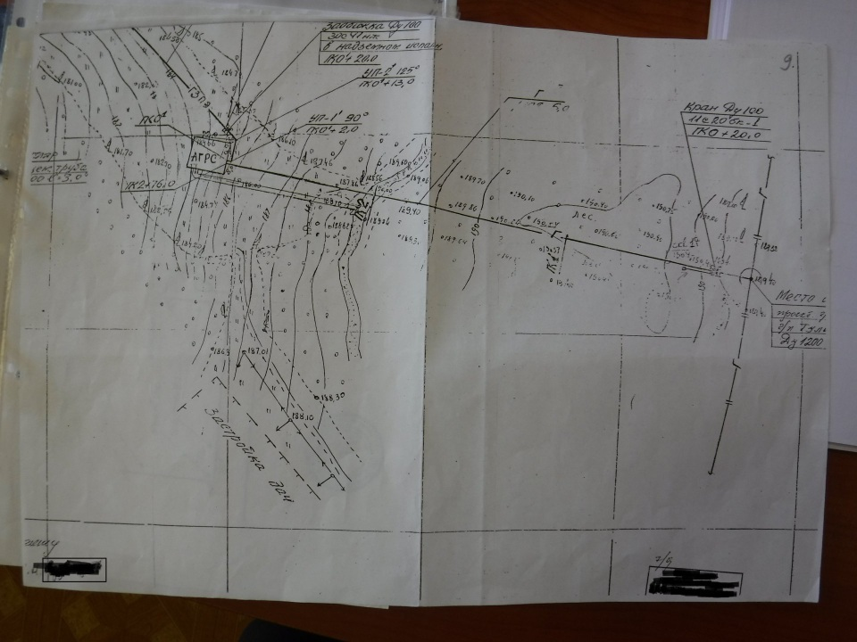
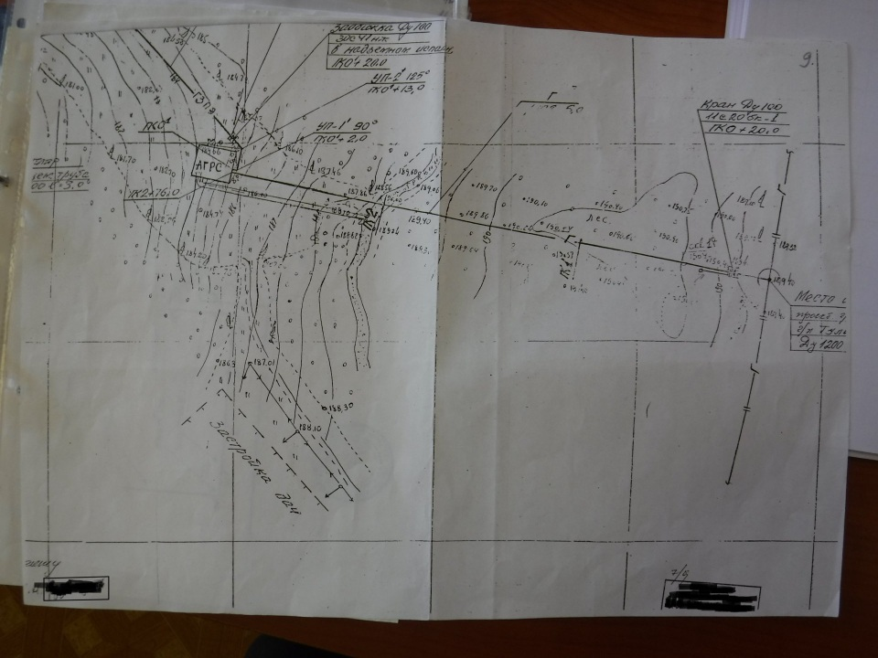
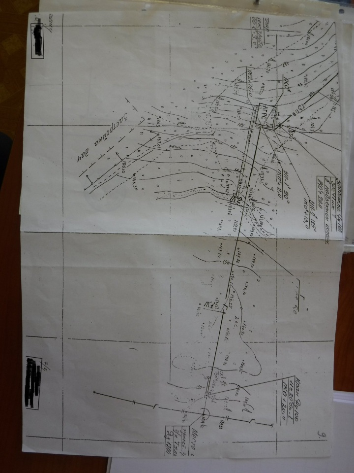
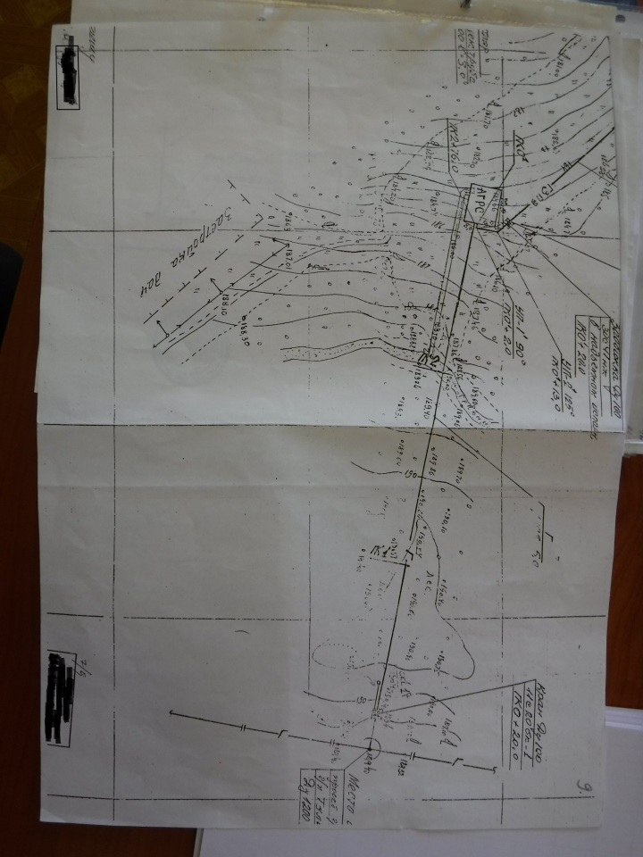
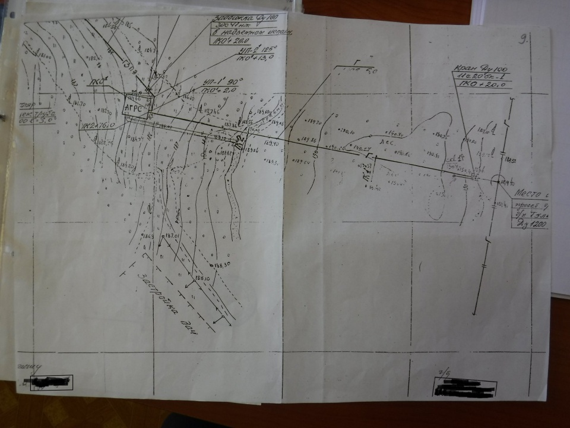

# PhotoQuick

([photoquick](https://github.com/ImageProcessing-ElectronicPublications/photoquick))

## Transform: Geometry: DeWarping

See issue https://github.com/ImageProcessing-ElectronicPublications/photoquick/issues/20

Origin:  

DeWarping {5 node}:  

Rotate 90:  

DeWarping {5 node}:  

Rotate 90:  

----

2021
