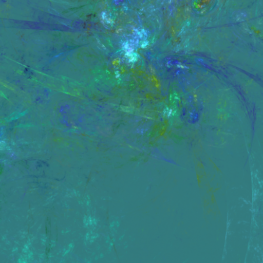

# PhotoQuick Plugins Examples

([photoquick-plugins](https://github.com/ImageProcessing-ElectronicPublications/photoquick-plugins))

## Filters: Colors

Origin:  
  

Gray Scale Local:  

Negate:  

Un Alpha:  

----

2021
