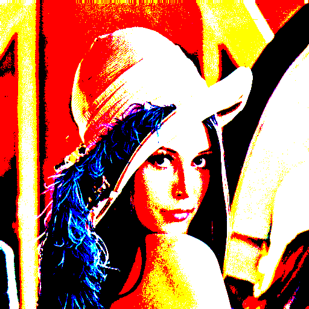
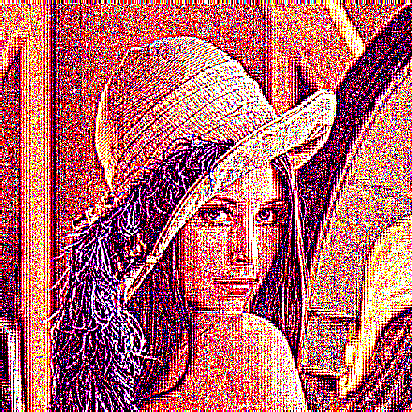
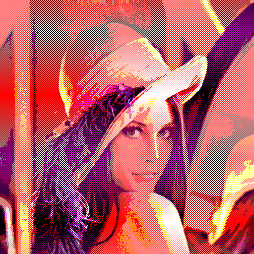
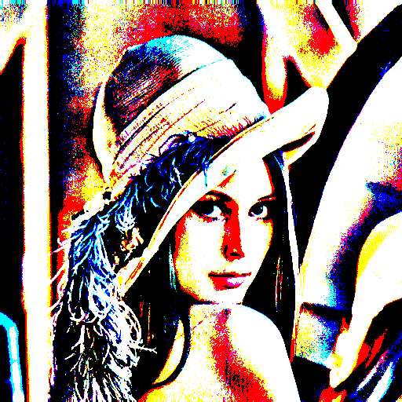

# PhotoQuick Plugins Examples

([photoquick-plugins](https://github.com/ImageProcessing-ElectronicPublications/photoquick-plugins))

## Filters: Threshold

Origin:  

Bimodal Threshold {2}:  

D-algoritm {4,0}:  

Dither {2,0,2}:  

Threshold BG Scale {0,8}:  

----

2020
